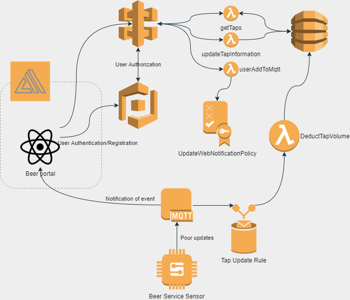

# BeerService
This is the web interface for an IoT beer monitoring service.  After authenticating, a user can view the active taps and how much capacity they have remaining.  Additionally, if a user is part of the administration group they can maintain and update and reset the volumes of the kegs on the system.
=======
## Firmware repostitory
When available the firmware repository will be linked here.

## Architecture

### Not yet implemented
* Management webpage